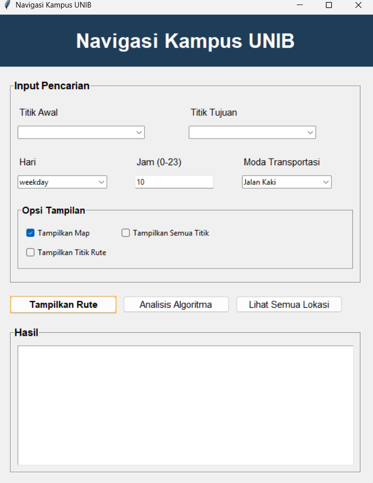
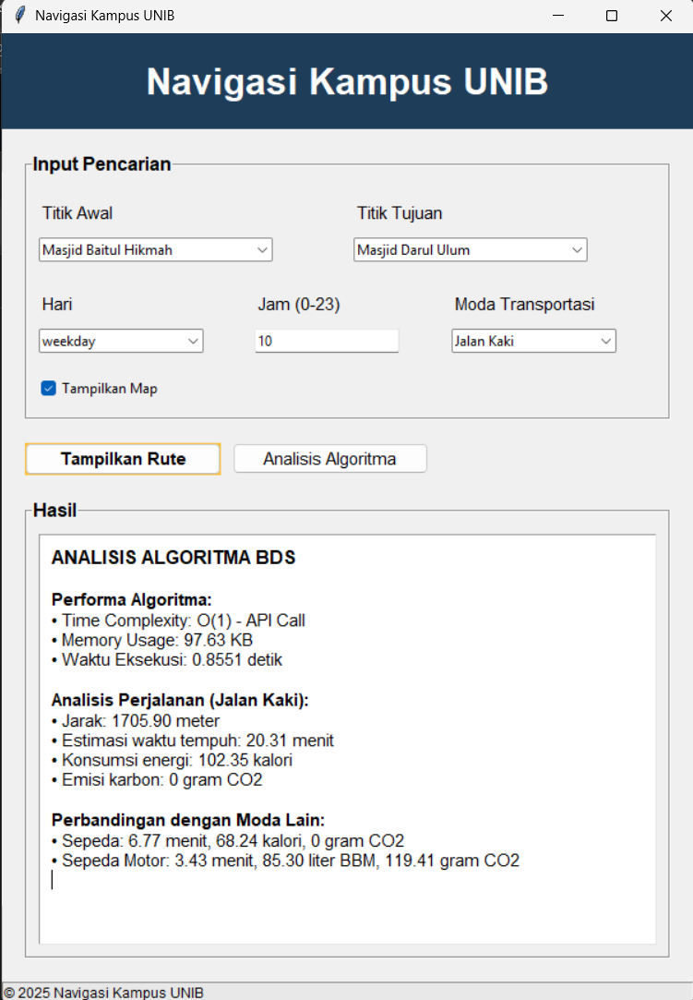

# 🚀 Search Map UNIB menggunakan Bidirectional Search

Aplikasi GUI interaktif untuk mencari rute tercepat antar lokasi di **Kampus Universitas Bengkulu** menggunakan algoritma **Bidirectional Search**, dilengkapi fitur visualisasi rute dan analisis performa algoritma.

---

## 👥 Anggota Kelompok 6

| Nama                     | GitHub                                      |
|--------------------------|---------------------------------------------|
| Agyl Wendi Pratama       | [likeazwee](https://github.com/likeazwee)  |
| Habib Al-Qodri           | [HabibAlQodri](https://github.com/HabibAlQodri) |
| Muhammad Ryan Al-Habsy   | [Starcres](https://github.com/Starcres)    |
| Sidik Bagus Firmansyah   | [Sidiqkun](https://github.com/Sidiqkun)    |
| Yohanes Adi Prasetya     | [Feuriee](https://github.com/Feuriee)      |

---

## 🧠 Algoritma dan Proses Pencarian

1. Tampilkan semua lokasi yang tersedia pada graf kampus UNIB.
2. Pengguna memasukkan **titik awal** dan **tujuan akhir**.
3. Validasi lokasi, jika tidak ditemukan → tampilkan pesan error.
4. Catat waktu mulai dan mulai pelacakan memori.
5. Cek apakah lokasi terhubung dengan **BFS**.
6. Jika terhubung, jalankan **Bidirectional Search**:
   - Dua antrian pencarian (dari awal dan dari tujuan)
   - Cari titik pertemuan di tengah
   - Bangun dan tampilkan **rute terpendek**
7. Catat waktu selesai dan memori maksimum.
8. Tampilkan ringkasan performa:
   - Waktu eksekusi
   - Memori terpakai
   - Kompleksitas algoritma

---

## 🖥️ Tampilan Antarmuka

### 🔍 Halaman Pencarian Rute



### 📊 Hasil Analisis Algoritma



> 📌 *Silakan masukkan screenshot pada folder `/screenshots/` dan ganti nama file sesuai.*

---

## ⚙️ Cara Menjalankan Aplikasi

### 1. Clone Repository

```bash
git clone https://github.com/NamaRepo/UNIB-RouteFinder.git
cd UNIB-RouteFinder
```

### 2. Install Dependencies (opsional)
```bash
pip install matplotlib psutil
```

### 3. Jalankan Aplikasi
```bash
python main.py
```

## ✅ Fitur Lengkap
- Pilihan lokasi asal dan tujuan
- Pemilihan moda transportasi: jalan kaki, sepeda, motor
- Pengaturan hari dan jam (menyesuaikan operasional gerbang kampus)
- Visualisasi jalur kampus
- Analisis performa algoritma: waktu, memori, kompleksitas
- Antarmuka GUI berbasis Tkinter


